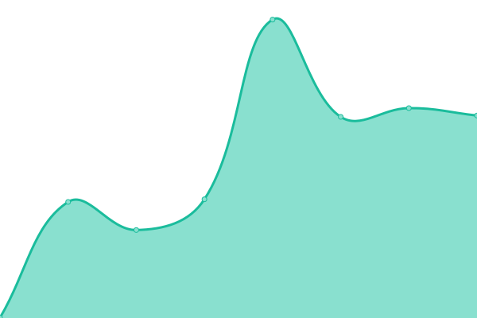
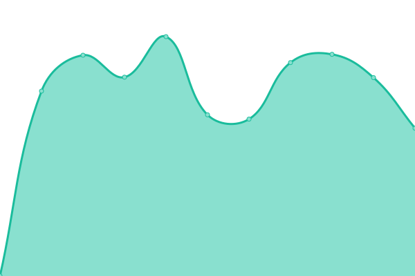
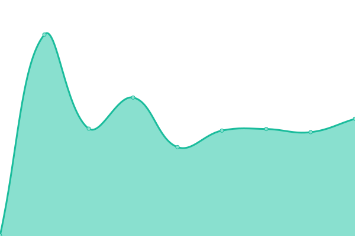
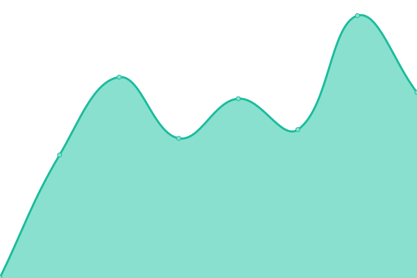

# [📈 Live Status](https://OleVikNTNU.github.io/Uptime): <!--live status--> **🟩 All systems operational**

This repository contains the open-source uptime monitor and status page for [Ole Vik NTNU](https://OleVikNTNU.github.io/Uptime), powered by [Upptime](https://github.com/upptime/upptime).

With [Upptime](https://upptime.js.org), you can get your own unlimited and free uptime monitor and status page, powered entirely by a GitHub repository. We use [Issues](https://github.com/OleVikNTNU/Uptime/issues) as incident reports, [Actions](https://github.com/OleVikNTNU/Uptime/actions) as uptime monitors, and [Pages](https://OleVikNTNU.github.io/Uptime) for the status page.

<!--start: status pages-->
<!-- This summary is generated by Upptime (https://github.com/upptime/upptime) -->
<!-- Do not edit this manually, your changes will be overwritten -->
<!-- prettier-ignore -->
| URL | Status | History | Response Time | Uptime |
| --- | ------ | ------- | ------------- | ------ |
|  [Innsida](https://i.ntnu.no/) | 🟩 Up | [innsida.yml](https://github.com/OleVikNTNU/Uptime/commits/HEAD/history/innsida.yml) | 

 881ms
     
 | 

<a href="https://OleVikNTNU.github.io/Uptime/history/innsida">100.00%</a>
    

|  [Temaside for saksbehandling](https://i.ntnu.no/saksbehandling) | 🟩 Up | [temaside-for-saksbehandling.yml](https://github.com/OleVikNTNU/Uptime/commits/HEAD/history/temaside-for-saksbehandling.yml) | 

 359ms
     
 | 

<a href="https://OleVikNTNU.github.io/Uptime/history/temaside-for-saksbehandling">100.00%</a>
    

|  [Arkivplan](https://ntnu.no/arkivplan) | 🟩 Up | [arkivplan.yml](https://github.com/OleVikNTNU/Uptime/commits/HEAD/history/arkivplan.yml) | 

 1608ms
     
 | 

<a href="https://OleVikNTNU.github.io/Uptime/history/arkivplan">100.00%</a>
    

|  [Arkivplan Wikihotell](https://www.ntnu.no/wiki/spaces/arkivplan/overview) | 🟩 Up | [arkivplan-wikihotell.yml](https://github.com/OleVikNTNU/Uptime/commits/HEAD/history/arkivplan-wikihotell.yml) | 

 293ms
     
 | 

<a href="https://OleVikNTNU.github.io/Uptime/history/arkivplan-wikihotell">100.00%</a>
    

|  [Arkivplan GitLab](https://ntnu-doku.gitlab.io/arkivplan) | 🟩 Up | [arkivplan-git-lab.yml](https://github.com/OleVikNTNU/Uptime/commits/HEAD/history/arkivplan-git-lab.yml) | 

 534ms
     
 | 

<a href="https://OleVikNTNU.github.io/Uptime/history/arkivplan-git-lab">100.00%</a>
    

|  [Arkivplan GitLab / Automatisering](https://ntnu-doku.gitlab.io/arkivplan/automatisering) | 🟩 Up | [arkivplan-git-lab-automatisering.yml](https://github.com/OleVikNTNU/Uptime/commits/HEAD/history/arkivplan-git-lab-automatisering.yml) | 

 143ms
     
 | 

<a href="https://OleVikNTNU.github.io/Uptime/history/arkivplan-git-lab-automatisering">100.00%</a>
    

|  [Avdeling for utvikling og virksomhetsstyring](https://www.ntnu.no/adm/auv) | 🟩 Up | [avdeling-for-utvikling-og-virksomhetsstyring.yml](https://github.com/OleVikNTNU/Uptime/commits/HEAD/history/avdeling-for-utvikling-og-virksomhetsstyring.yml) | 

 505ms
     
 | 

<a href="https://OleVikNTNU.github.io/Uptime/history/avdeling-for-utvikling-og-virksomhetsstyring">100.00%</a>
    

<!--end: status pages-->

[**Visit our status website →**](https://OleVikNTNU.github.io/Uptime)

## 📄 License

- Powered by: [Upptime](https://github.com/upptime/upptime)
- Code: [MIT](./LICENSE) © [Ole Vik NTNU](https://OleVikNTNU.github.io/Uptime)
- Data in the `./history` directory: [Open Database License](https://opendatacommons.org/licenses/odbl/1-0/)
